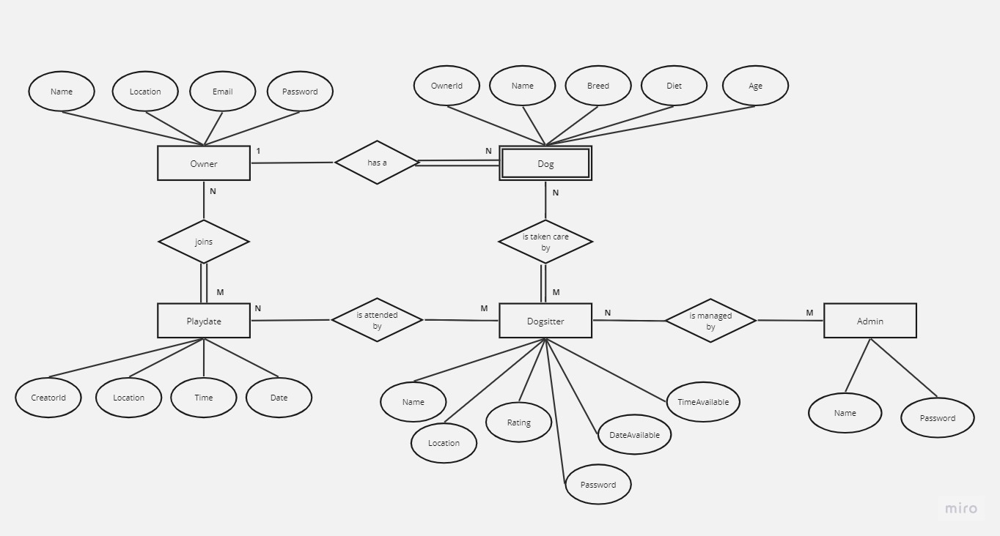
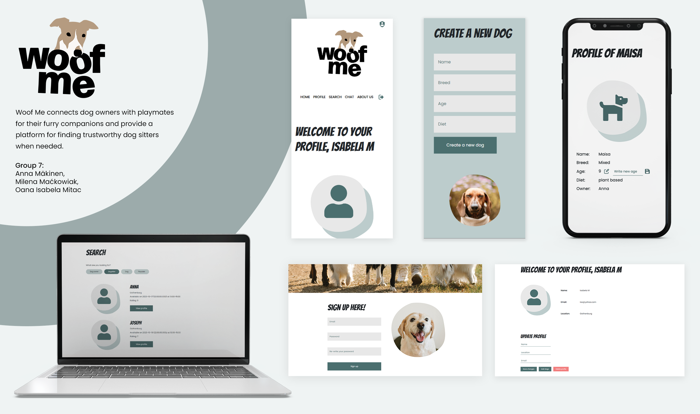

## System Definition (MS0)

### Purpose

Woof me is a website for dog owners and dog lovers. The main purpose of the website is to help dog owners to find a playdate for their furry friend. Dog owners can also find dog sitters, if they are away and need someone to take care of their little pupper. If you don't have a dog of your own, you can always try to find one to sit! Our website is fully free to make sure that dogs are surrounded by people who love them.

### Pages

* Home (landing page): A welcome page with CTAs to signing up and searching. The user can be redirected to either their profile page for sign up/log in, or to the search page to specify their filters to find what they are looking for.
* Profile: The user profile with personal information about them and their dog, including some settings. The user can add, modify, and remove information about themselves and their dogs on this page.
* Search: The user can look for playdates, dog owners, and/or dog sitters. The search has different filters for example for location, dogs, dates, and whether the user is looking for other dog owners or a dog sitter.
* Chat: The chat function let's the logged in users to chat with each other to plan the playdates or dog sitting.
* About us: The user can find information about Woof me. About us page tells the purpose of Woof me, and how it all started.
* Privacy policy: This page let's the user know what type of information we collect from our users, why, and how they can access it.

### Entity-Relationship (ER) Diagram

## Teaser (MS3)

(to be updated)

##Contributors
Anna Mäkinen
Milena Mackowiak
Oana Isabela Mitac
